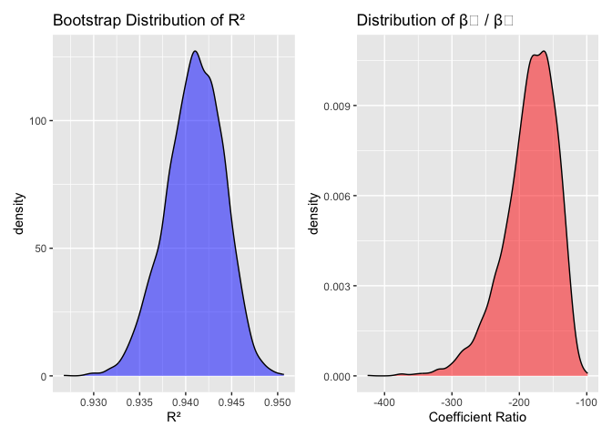

p8105_hw6_sp4436
================
Sukhman Parhar
2025-12-03

``` r
library(tidyverse)
library(readxl)
library(haven)
library(readr) 
library(p8105.datasets)
library(ggridges)
library(dplyr)
library(janitor)
library(patchwork)
library(broom)
library(modelr)
```

## Problem 1

``` r
homicide_df =
  read_csv("https://raw.githubusercontent.com/washingtonpost/data-homicides/master/homicide-data.csv") |> 
  janitor::clean_names() |>
  mutate(
    city_state = str_c(city, ", ", state)
  ) |>
  filter(
    !city_state %in% c("Dallas, TX", "Phoenix, AZ", "Kansas City, MO", "Tulsa, AL"),
    victim_race %in% c("White", "Black")
  ) |>
  mutate(
    victim_age = as.numeric(victim_age),
    case_status = ifelse(disposition == "Closed by arrest", 1, 0)
  ) |>
  filter(!is.na(victim_age))
```

    ## Rows: 52179 Columns: 12
    ## ── Column specification ────────────────────────────────────────────────────────
    ## Delimiter: ","
    ## chr (9): uid, victim_last, victim_first, victim_race, victim_age, victim_sex...
    ## dbl (3): reported_date, lat, lon
    ## 
    ## ℹ Use `spec()` to retrieve the full column specification for this data.
    ## ℹ Specify the column types or set `show_col_types = FALSE` to quiet this message.

    ## Warning: There was 1 warning in `mutate()`.
    ## ℹ In argument: `victim_age = as.numeric(victim_age)`.
    ## Caused by warning:
    ## ! NAs introduced by coercion

``` r
baltimore_results =
  homicide_df |> 
  filter(city_state == "Baltimore, MD") |> 
  glm(
    case_status ~ victim_age + victim_sex + victim_race,
    family = binomial(),
    data = _
  ) |> 
  broom::tidy(conf.int = TRUE) |> 
  mutate(
    OR = exp(estimate),
    OR_CI_lower = exp(conf.low),
    OR_CI_upper = exp(conf.high)
  ) |>
  filter(term == "victim_sexMale") |> 
  select(term, log_OR = estimate, OR, p.value, OR_CI_lower, OR_CI_upper)

baltimore_results |> knitr::kable(digits = 3)
```

| term           | log_OR |    OR | p.value | OR_CI_lower | OR_CI_upper |
|:---------------|-------:|------:|--------:|------------:|------------:|
| victim_sexMale | -0.854 | 0.426 |       0 |       0.324 |       0.558 |

The adjusted odds ratio for solving homicides comparing male victims to
female victims in Baltimore is 0.426 (95% CI: 0.324, 0.558), controlling
for victim age and race.

Because the confidence interval does not include 1, this association is
statistically significant. This OR indicates that homicides involving
male victims have approximately 57% lower odds of being solved than
homicides involving female victims, after accounting for age and race. A
range of reasonable estimates for the true odds ratio comparing the
probability of solving homicides involving male victims versus female
victims, consistent with our data and model assumptions, is between
0.324 and 0.558.

``` r
city_or_results =
  homicide_df |> 
  nest(data = -city_state) |> 
  mutate(
    fit = map(
      data,
      ~ glm(case_status ~ victim_age + victim_sex + victim_race,
            family = binomial(), data = .x)
    ),
    tidy_fit = map(fit, ~ broom::tidy(.x, conf.int = TRUE))
  ) |>
  unnest(tidy_fit) |>
  filter(term == "victim_sexMale") |>
  mutate(
    OR = exp(estimate),
    OR_CI_lower = exp(conf.low),
    OR_CI_upper = exp(conf.high)
  ) |>
  select(city_state, OR, OR_CI_lower, OR_CI_upper)
```

    ## Warning: There were 43 warnings in `mutate()`.
    ## The first warning was:
    ## ℹ In argument: `tidy_fit = map(fit, ~broom::tidy(.x, conf.int = TRUE))`.
    ## Caused by warning:
    ## ! glm.fit: fitted probabilities numerically 0 or 1 occurred
    ## ℹ Run `dplyr::last_dplyr_warnings()` to see the 42 remaining warnings.

``` r
city_or_results |> 
  knitr::kable(digits = 3)
```

| city_state         |    OR | OR_CI_lower | OR_CI_upper |
|:-------------------|------:|------------:|------------:|
| Albuquerque, NM    | 1.767 |       0.825 |       3.762 |
| Atlanta, GA        | 1.000 |       0.680 |       1.458 |
| Baltimore, MD      | 0.426 |       0.324 |       0.558 |
| Baton Rouge, LA    | 0.381 |       0.204 |       0.684 |
| Birmingham, AL     | 0.870 |       0.571 |       1.314 |
| Boston, MA         | 0.674 |       0.353 |       1.277 |
| Buffalo, NY        | 0.521 |       0.288 |       0.936 |
| Charlotte, NC      | 0.884 |       0.551 |       1.391 |
| Chicago, IL        | 0.410 |       0.336 |       0.501 |
| Cincinnati, OH     | 0.400 |       0.231 |       0.667 |
| Columbus, OH       | 0.532 |       0.377 |       0.748 |
| Denver, CO         | 0.479 |       0.233 |       0.962 |
| Detroit, MI        | 0.582 |       0.462 |       0.734 |
| Durham, NC         | 0.812 |       0.382 |       1.658 |
| Fort Worth, TX     | 0.669 |       0.394 |       1.121 |
| Fresno, CA         | 1.335 |       0.567 |       3.048 |
| Houston, TX        | 0.711 |       0.557 |       0.906 |
| Indianapolis, IN   | 0.919 |       0.678 |       1.241 |
| Jacksonville, FL   | 0.720 |       0.536 |       0.965 |
| Las Vegas, NV      | 0.837 |       0.606 |       1.151 |
| Long Beach, CA     | 0.410 |       0.143 |       1.024 |
| Los Angeles, CA    | 0.662 |       0.457 |       0.954 |
| Louisville, KY     | 0.491 |       0.301 |       0.784 |
| Memphis, TN        | 0.723 |       0.526 |       0.984 |
| Miami, FL          | 0.515 |       0.304 |       0.873 |
| Milwaukee, wI      | 0.727 |       0.495 |       1.054 |
| Minneapolis, MN    | 0.947 |       0.476 |       1.881 |
| Nashville, TN      | 1.034 |       0.681 |       1.556 |
| New Orleans, LA    | 0.585 |       0.422 |       0.812 |
| New York, NY       | 0.262 |       0.133 |       0.485 |
| Oakland, CA        | 0.563 |       0.364 |       0.867 |
| Oklahoma City, OK  | 0.974 |       0.623 |       1.520 |
| Omaha, NE          | 0.382 |       0.199 |       0.711 |
| Philadelphia, PA   | 0.496 |       0.376 |       0.650 |
| Pittsburgh, PA     | 0.431 |       0.263 |       0.696 |
| Richmond, VA       | 1.006 |       0.483 |       1.994 |
| San Antonio, TX    | 0.705 |       0.393 |       1.238 |
| Sacramento, CA     | 0.669 |       0.326 |       1.314 |
| Savannah, GA       | 0.867 |       0.419 |       1.780 |
| San Bernardino, CA | 0.500 |       0.166 |       1.462 |
| San Diego, CA      | 0.413 |       0.191 |       0.830 |
| San Francisco, CA  | 0.608 |       0.312 |       1.155 |
| St. Louis, MO      | 0.703 |       0.530 |       0.932 |
| Stockton, CA       | 1.352 |       0.626 |       2.994 |
| Tampa, FL          | 0.808 |       0.340 |       1.860 |
| Tulsa, OK          | 0.976 |       0.609 |       1.544 |
| Washington, DC     | 0.690 |       0.465 |       1.012 |

``` r
## Plot of city-specific ORs and 95% CIs (Male vs Female victims)

city_or_results |>
  arrange(OR) |>
  mutate(city_state = factor(city_state, levels = city_state)) |>
  ggplot(aes(x = OR, y = city_state)) +
  geom_point() +
  geom_errorbarh(aes(xmin = OR_CI_lower, xmax = OR_CI_upper), width = 0.15) +
  geom_vline(xintercept = 1, linetype = "dashed", color = "red") +
  labs(
    title = "Adjusted Odds of Solving Homicides: Male vs Female Victims",
    x = "Odds ratio (Male vs Female victims)",
    y = "City"
  ) +
  theme_minimal()
```

    ## Warning: `geom_errobarh()` was deprecated in ggplot2 4.0.0.
    ## ℹ Please use the `orientation` argument of `geom_errorbar()` instead.
    ## This warning is displayed once every 8 hours.
    ## Call `lifecycle::last_lifecycle_warnings()` to see where this warning was
    ## generated.

<!-- -->

This plot shows substantial variation across cities in the adjusted odds
of solving homicides involving male victims compared to female victims
after controlling for victim age and race. Several cities (Albuquerque,
NM; Stockton, CA; and Fresno, CA) have the highest estimated odds
ratios, suggesting that male-victim homicides are more likely to be
solved than female-victim homicides. However, these estimates have very
wide confidence intervals that include the null value of 1, meaning
there is no statistically significant evidence of a difference in solve
probability in these cities.

At the lower end, cities such as New York, NY; Baton Rouge, LA; and
Omaha, NE show the lowest odds ratios, indicating that homicides
involving male victims are less likely to be solved than those involving
female victims. In these cities, the confidence intervals lie below 1,
providing statistically significant evidence for lower solve rates among
male-victim cases. The CIs for these cities overlap so wecannot see
which city has the lowest OR.

The plot shows that many cities show lower solve rates for male victims,
the precision varies widely, and statistical significance is mainly seen
among cities with larger sample sizes and narrower confidence intervals.

## Problem 2

``` r
set.seed(1)
data("weather_df")

bootstrap_results =
  weather_df |>
  modelr::bootstrap(n = 5000) |>
  mutate(
    models = map(strap, \(df) lm(tmax ~ tmin + prcp, data = df)),
    results_glance = map(models, broom::glance),
    results_tidy = map(models, broom::tidy)
  ) |>
  select(-strap, -models) |>
  unnest(results_glance) |>
  select(.id, r.squared, results_tidy) |>
  unnest(results_tidy) |>
  select(.id, r.squared, term, estimate) |>
  pivot_wider(
    names_from = term,
    values_from = estimate
  ) |>
  mutate(
    beta_ratio = tmin / prcp   # β̂₁ / β̂₂
  )
```

``` r
p1 = bootstrap_results |>
  ggplot(aes(x = r.squared)) +
  geom_density(fill = "blue", alpha = 0.5) +
  labs(title = "Bootstrap Distribution of R²", x = "R²")

p2 = bootstrap_results |>
  ggplot(aes(x = beta_ratio)) +
  geom_density(fill = "red", alpha = 0.5) +
  labs(title = "Distribution of β₁ / β₂", x = "Coefficient Ratio")

p1 + p2
```

<!-- -->

``` r
ci_results =
  bootstrap_results |>
  summarize(
    r_squared_low = quantile(r.squared, 0.025),
    r_squared_high = quantile(r.squared, 0.975),
    beta_ratio_low = quantile(beta_ratio, 0.025),
    beta_ratio_high = quantile(beta_ratio, 0.975)
  )

knitr::kable(ci_results, digits = 4)
```

| r_squared_low | r_squared_high | beta_ratio_low | beta_ratio_high |
|--------------:|---------------:|---------------:|----------------:|
|        0.9344 |         0.9466 |      -279.7489 |       -125.6859 |

## Problem 3

``` r
bw_df = read_csv("birthweight.csv") |> 
  janitor::clean_names() |> 
  mutate(
    babysex = factor(babysex, levels = c(1, 2),
                     labels = c("Male", "Female")),
    
    frace = factor(frace, 
                   levels = c(1, 2, 3, 4, 8, 9),
                   labels = c("White", "Black", "Asian", "Puerto Rican", "Other", "Unknown")),
    
    mrace = factor(mrace,
                   levels = c(1, 2, 3, 4, 8),
                   labels = c("White", "Black", "Asian", "Puerto Rican", "Other")),
    
    malform = factor(malform, 
                     levels = c(0, 1),
                     labels = c("Absent", "Present"))
  )
```

    ## Rows: 4342 Columns: 20
    ## ── Column specification ────────────────────────────────────────────────────────
    ## Delimiter: ","
    ## dbl (20): babysex, bhead, blength, bwt, delwt, fincome, frace, gaweeks, malf...
    ## 
    ## ℹ Use `spec()` to retrieve the full column specification for this data.
    ## ℹ Specify the column types or set `show_col_types = FALSE` to quiet this message.

``` r
summary(is.na(bw_df))
```

    ##   babysex          bhead          blength           bwt         
    ##  Mode :logical   Mode :logical   Mode :logical   Mode :logical  
    ##  FALSE:4342      FALSE:4342      FALSE:4342      FALSE:4342     
    ##    delwt          fincome          frace          gaweeks       
    ##  Mode :logical   Mode :logical   Mode :logical   Mode :logical  
    ##  FALSE:4342      FALSE:4342      FALSE:4342      FALSE:4342     
    ##   malform         menarche        mheight          momage       
    ##  Mode :logical   Mode :logical   Mode :logical   Mode :logical  
    ##  FALSE:4342      FALSE:4342      FALSE:4342      FALSE:4342     
    ##    mrace           parity         pnumlbw         pnumsga       
    ##  Mode :logical   Mode :logical   Mode :logical   Mode :logical  
    ##  FALSE:4342      FALSE:4342      FALSE:4342      FALSE:4342     
    ##    ppbmi            ppwt           smoken          wtgain       
    ##  Mode :logical   Mode :logical   Mode :logical   Mode :logical  
    ##  FALSE:4342      FALSE:4342      FALSE:4342      FALSE:4342

The following model focuses on maternal risk factors and pregnancy
characteristics that are associated with infant birthweight. The
following predictors are hypothesized to drive birthweight:

Gestational age (gaweeks)

Maternal age at delivery (momage)

Pre-pregnancy BMI (ppbmi)

Weight gain during pregnancy (wtgain)

Smoking during pregnancy (smoken)

Maternal race (mrace)

Family income (fincome)

Several available variables were evaluated for inclusion but excluded.
Variables such as pnumlbw (previous low birthweight babies) and parity
showed extremely limited variability in the dataset. They provided no
additional explanatory power. Infant physical measurements (blength,
bhead) were not included because they capture fetal growth outputs
rather than maternal predictors.

``` r
bw_mod_main =
  lm(
    bwt ~ gaweeks + momage + ppbmi + wtgain + smoken + mrace + fincome,
    data = bw_df
  )

summary(bw_mod_main)
```

    ## 
    ## Call:
    ## lm(formula = bwt ~ gaweeks + momage + ppbmi + wtgain + smoken + 
    ##     mrace + fincome, data = bw_df)
    ## 
    ## Residuals:
    ##      Min       1Q   Median       3Q      Max 
    ## -1755.79  -264.58     6.26   278.58  1692.53 
    ## 
    ## Coefficients:
    ##                    Estimate Std. Error t value Pr(>|t|)    
    ## (Intercept)        467.3757    99.2448   4.709 2.56e-06 ***
    ## gaweeks             53.3143     2.1342  24.981  < 2e-16 ***
    ## momage               2.5640     1.8752   1.367   0.1716    
    ## ppbmi               19.9600     2.0888   9.556  < 2e-16 ***
    ## wtgain              10.0466     0.6095  16.485  < 2e-16 ***
    ## smoken             -11.3810     0.9108 -12.496  < 2e-16 ***
    ## mraceBlack        -281.9344    15.8070 -17.836  < 2e-16 ***
    ## mraceAsian        -121.7703    67.1100  -1.814   0.0697 .  
    ## mracePuerto Rican -179.3741    29.8159  -6.016 1.93e-09 ***
    ## fincome              0.5212     0.2806   1.857   0.0634 .  
    ## ---
    ## Signif. codes:  0 '***' 0.001 '**' 0.01 '*' 0.05 '.' 0.1 ' ' 1
    ## 
    ## Residual standard error: 429.2 on 4332 degrees of freedom
    ## Multiple R-squared:  0.2991, Adjusted R-squared:  0.2976 
    ## F-statistic: 205.4 on 9 and 4332 DF,  p-value: < 2.2e-16

``` r
bw_df |> 
  add_predictions(bw_mod_main) |> 
  add_residuals(bw_mod_main) |> 
  ggplot(aes(x = pred, y = resid)) +
  geom_point(alpha = 0.3) +
  geom_hline(yintercept = 0, color = "red", linetype = "dashed") +
  labs(
    title = "Residuals vs Fitted Values (Model 1)",
    x = "Fitted Values (Predicted Birthweight)",
    y = "Residuals"
  ) +
  theme_minimal()
```

<!-- -->

``` r
bw_mod_simple =
  lm(bwt ~ blength + gaweeks, data = bw_df)

bw_mod_interaction =
  lm(bwt ~ bhead * blength * gaweeks, data = bw_df)
```

``` r
set.seed(1)

#Generate CV splits and convert to tibbles
cv_df =
  crossv_mc(bw_df, n = 100) |>
  mutate(
    train = map(train, as_tibble),
    test  = map(test,  as_tibble)
  )

#Fit all three models on each training fold
cv_df =
  cv_df |>
  mutate(
    mod_main   = map(train, \(df) lm(bwt ~ gaweeks + momage + ppbmi + wtgain + smoken + mrace + fincome, data = df)),
    mod_simple = map(train, \(df) lm(bwt ~ blength + gaweeks, data = df)),
    mod_inter  = map(train, \(df) lm(bwt ~ bhead * blength * gaweeks, data = df))
  )

#Compute RMSE
cv_df =
  cv_df |>
  mutate(
    rmse_main   = map2_dbl(mod_main,   test, modelr::rmse),
    rmse_simple = map2_dbl(mod_simple, test, modelr::rmse),
    rmse_inter  = map2_dbl(mod_inter,  test, modelr::rmse)
  )

#Pivot into long format for plotting
cv_long =
  cv_df |>
  select(starts_with("rmse")) |>
  pivot_longer(
    everything(),
    names_to = "model",
    values_to = "rmse",
    names_prefix = "rmse_"
  ) |>
  mutate(
    model = fct_inorder(recode(model,
                               main   = "Main model",
                               simple = "Length + GA",
                               inter  = "3-way interaction"))
  )

#Violin plot 
cv_long |>
  ggplot(aes(x = model, y = rmse, fill = model)) +
  geom_violin(alpha = 0.7, color = "black") +
  scale_fill_viridis_d() +
  labs(
    title = "Model Comparison via Cross-Validation",
    x = "Model",
    y = "Root Mean Squared Error (RMSE)"
  ) +
  theme_minimal()
```

<!-- -->

The cross-validated RMSE plot shows clear differences in predictive
performance across the three models. The maternal-factor model (My
Model) has the highest RMSE values and the largest spread. This means
that it performs the worst in terms of predicting birthweight.

The Length + Gestational Age model (Model 2) performs better, with lower
RMSE values. Birth length and gestational age are direct markers of
fetal growth, so they provide much stronger predictive information than
maternal factors alone.

The full interaction model (Model 3), which incorporates head
circumference, length, sex, and all lower-order interactions, achieves
the lowest RMSE overall.

Overall, the my model is not optimal for prediction. The other two
models are have better predictive accuracy mainly the model including
the interaction term.
